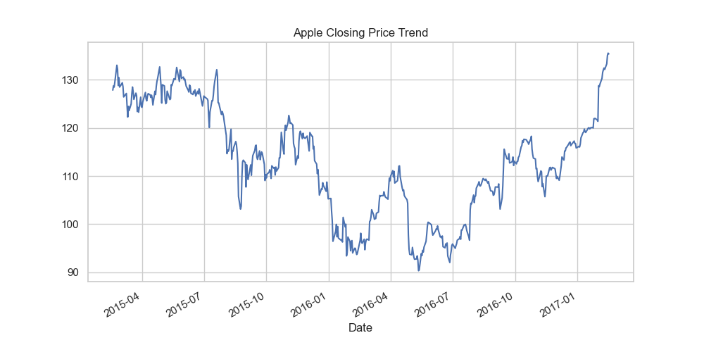
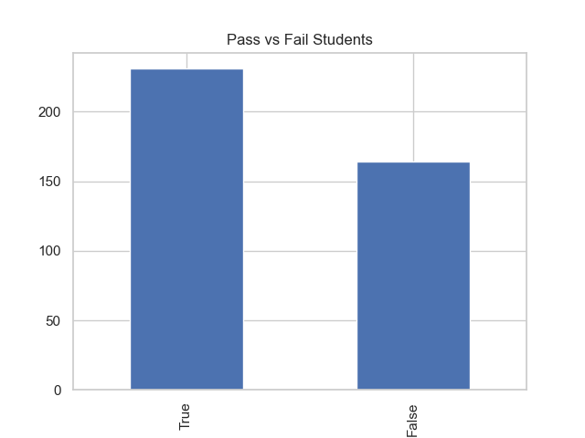
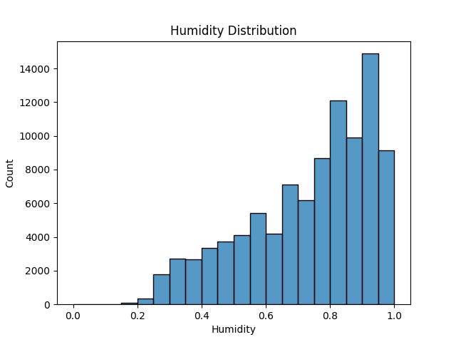
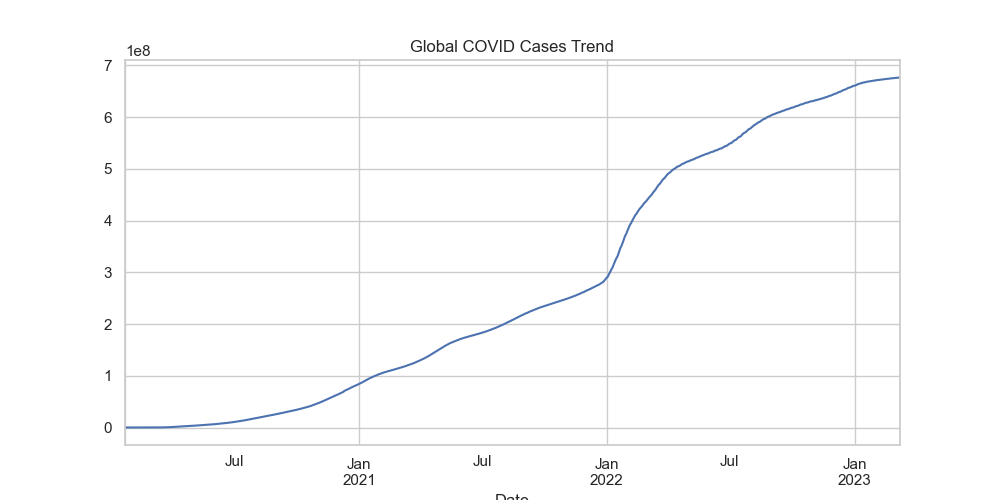
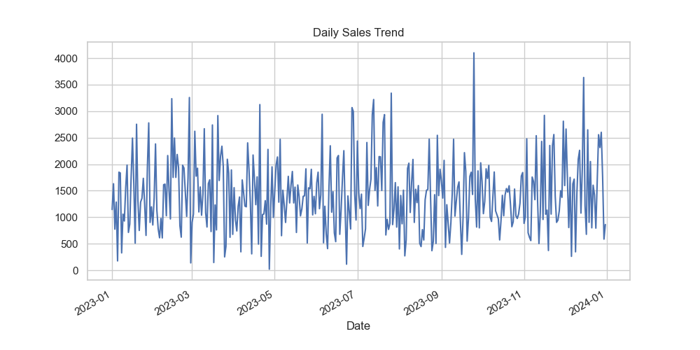

# 📊 Data Analysis Portfolio  
**Aniketanand Sandipkumar**  
*Aspirant Data Analyst | Data Science Enthusiast*

[](https://www.python.org/)
[](https://pandas.pydata.org/)
[](https://numpy.org/)
[](https://matplotlib.org/)
[](https://seaborn.pydata.org/)
[](https://jupyter.org/)
[]()
[]()

---

## 👨‍💻 Professional Summary

Data-focused problem solver with hands-on experience in cleaning, analyzing, and interpreting real-world datasets across multiple domains.  
I turn raw data into structured insights, visual stories, and actionable business recommendations using Python-based analytics workflows.  

**Core strengths include:**
- Data Cleaning & Preprocessing  
- Statistical Analysis & Hypothesis Testing  
- Exploratory Data Analysis (EDA)  
- Insightful Data Visualizations  
- Business-focused Interpretation  
- Automated Reporting  

---

## 🎯 Portfolio Objective

Simulate **real industry data analysis scenarios** across multiple domains.  
Each project demonstrates a complete analytics pipeline:

**Raw Data → Cleaning → Analysis → Visualization → Insights → Recommendations → Reporting**  

Goal: Highlight **technical skills** + **communication clarity**.

---

## 🛠 Tools & Technologies

| Area | Tools |
|------|------|
| Programming | Python 3.11 |
| Data Analysis | Pandas, NumPy |
| Visualization | Matplotlib, Seaborn |
| Statistics | Correlation, Hypothesis Testing, Trend Analysis |
| Reporting | Automated summary generation |
| Environment | Jupyter Notebook |

---

## 📂 Projects Overview

### 🛒 Retail Sales Analysis
**Objective:** Understand product performance, revenue trends, and customer behavior.

**Technical Work**
- Aggregated sales by product & date  
- Trend analysis on daily revenue  
- Correlation between quantity & sales  
- Category performance visualizations  

**Business Insights**
- Highest revenue-generating product lines  
- Daily sales fluctuations identified  
- Suggested inventory & promotion improvements  

**Preview Visuals:**  


---

### 🎓 Student Performance Analysis
**Objective:** Analyze academic performance & attendance impact.

**Technical Work**
- Pass/fail classification  
- Attendance-performance correlation  
- Hypothesis testing  
- Marks distribution visualization  

**Business Insights**
- Attendance strongly influences performance  
- Students at risk identified  
- Recommended monitoring systems  

**Preview Visuals:**  


---

### 🌦 Weather Data Analysis
**Objective:** Identify seasonal patterns & climate trends.

**Technical Work**
- Time-series trend analysis  
- Monthly aggregation  
- Temperature & rainfall distribution  

**Business Insights**
- Seasonal variations detected  
- Peak temperature periods highlighted  
- Supports planning & risk mitigation  

**Preview Visuals:**  


---

### 🏥 Healthcare Trend Analysis
**Objective:** Analyze case trends & peak healthcare demand.

**Technical Work**
- Daily case trends  
- Peak detection  
- Average case rate computation  

**Business Insights**
- Surge periods identified  
- Healthcare load patterns highlighted  
- Supports capacity planning  

**Preview Visuals:**  


---

### 💰 Financial Market Analysis
**Objective:** Study market trends & volatility.

**Technical Work**
- Stock price time-series analysis  
- Volatility measurement  
- Moving averages  

**Business Insights**
- Price fluctuation patterns identified  
- Market risk levels measured  
- Supports investment decisions  

**Preview Visuals:**  


---

## 🔍 Methodology Used

Each project follows this workflow:

1. Data Loading & Exploration  
2. Data Cleaning  
3. Feature Engineering  
4. Exploratory Data Analysis  
5. Statistical Analysis  
6. Visualization  
7. Insight Extraction  
8. Automated Reporting  

---

## 📁 Repository Structure

```
Data-Analysis-Portfolio/
│
├── README.md
├── requirements.txt
├── data/
├── notebooks/
├── src/
├── visualizations/
├── reports/
├── presentation/
└── docs/
```

---

## ▶ How to Run

1. Clone the repository  
2. Install dependencies  
   ```
   pip install -r requirements.txt
   ```
3. Start Jupyter Notebook  
   ```
   jupyter notebook
   ```
4. Run notebooks from `/notebooks`

---

## 💡 Key Strengths Demonstrated

- Multi-domain data handling  
- Structured analytical thinking  
- Strong EDA skills  
- Statistical understanding  
- Visualization storytelling  
- Business-focused insight generation  

---

## 📌 Career Focus

Seeking opportunities in:

- Data Analytics  
- Business Intelligence  
- Entry-level Data Science  

---

📫 Open to internships, entry-level roles, and collaborative data projects.
